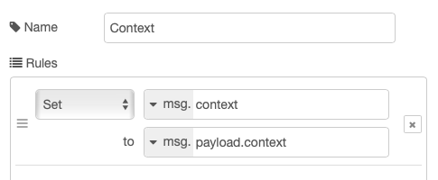
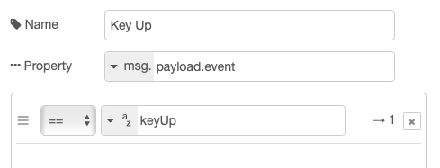
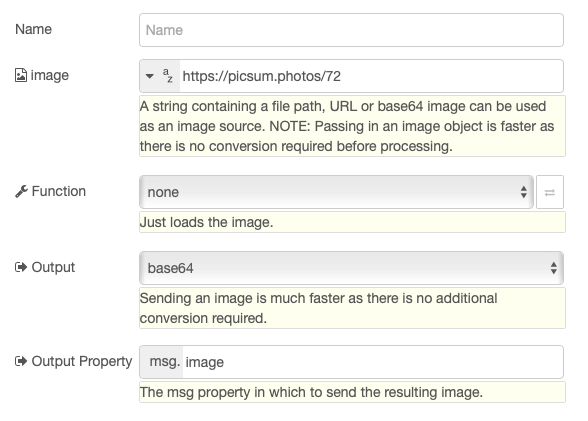

## About

StreamDeckWS is a WebSocket proxy for Corsair Stream Deck.

Now you can send and receive messages for your Stream Deck from remote servers
like Node-RED websocket plugin.

Not only you will receive key and other events in Node-RED, but you will also
be able to build messages to change button title, image, etc.

## Configuration

Simply put the address of the remote server as `ws://remote_server`. For Node-RED, it will likely be something like `ws://192.168.10.100:1880/sd-demo` or whatever websocket path you defined.


`id` can be used to identify each button. It can be found in the `settings` object of the payload to the remote server.

Do not set anything in *Title* if you want to be able to change title through the remote server

## Node-RED

Let's build a sample Node-RED flow that returns a random image
every time you push a button.


### Websocket node

First of all, drag a **websocket in** node and define a websocket endpoint, for example `/sd-demo`. *Type* should be set to *Listen on* and *Send / Receive* to *payload*.

### JSON Parser

Then drag a JSON Parser so the input is converted into a JSON object.

### Save context

`context` is a critical element from the request because it will be needed in
any message we are sending back to the Stream Deck, so it's a good idea to put
it aside for later.

Drag a **Change** node and configure it like so :



That way when the payload is overwritten by subsequent nodes, you can always retrieve the context from the message.

### Act on Key up only

The Stream Deck sends two messages for each press : *Key down* and *Key up*, in our case, let's say we're only interested in *Key up*.

Drag a **Switch** node and configure it like so :



### Get some image from The Internet

Next we will use a node that is not standard with node red, you will have to install it from the *Manage palette*. The node you need is `node-red-contrib-image-tools`.

Then drag an **Image** node and set the following properties :



### Format the message back to Stream Deck

Drag a Change node and set `msg.payload` to the following `expression`

```
{
   "event":"setImage",
   "context":context,
   "payload":{
       "image":image
   }
}
```

### Send the message back

Lastly, drag a **websocket out** node and make sure it is configured for the same endpoint and the **websocket in** node.

### Testing

If you're lucky enough, when you push the button you assigned for the StreamDeckWS plugin with the correct URL to Node-RED, you should see an image replace the default icon, and be replaced every time you push it.